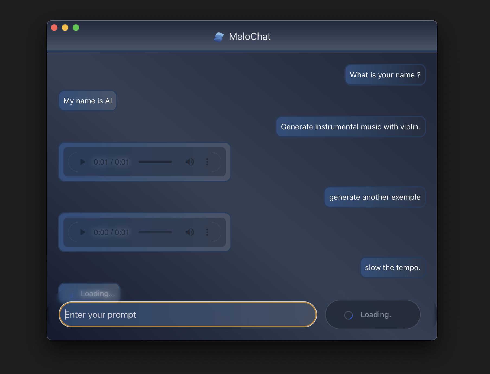

## MeloChat: Copilot for Music Production

MeloChat is an chatbot project that merges Golang, Python's Flask, and Solid.js to create a music-generating tool.

<figure>
  
  <figcaption>Example of the app interface. (Duration is set to 1 sec for testing.)</figcaption>
</figure>

This app leverages the Audiocraft model to enhance its capabilities in generating music and delivering audio interactions. Acquire the Audiocraft Hugging Face model from [Hugging Face](https://huggingface.co/spaces/facebook/MusicGen/tree/main/audiocraft).

### Getting Started

To start the application, follow these simple steps:

1. **Configure Model Configurations**: Customize the configurations within the relevant files for Golang Echo and Flask.

2. **Install Golang**: Ensure Golang is installed on your system.

3. **Install Python and Flask**: Verify Python is installed, then install Flask using pip.

4. **Install Node.js and npm**: Confirm Node.js and npm are installed on your system.

5. **Run Backend Servers**: Navigate to the backend directory and execute `make run-local`.

6. **Run Frontend**: Access the frontend directory and perform `npm install`, followed by `npm run start-electron` to launch the Solid.js frontend server.

---
This project is licensed under the [MIT License](https://opensource.org/licenses/MIT).